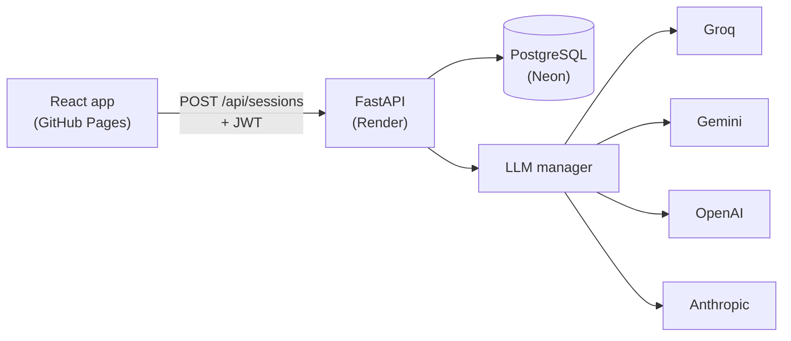

# CodeMentor AI

> **Code generators give you answers. CodeMentor AI builds your understanding.**

CodeMentor AI is a Socratic programming mentor. Paste a broken function and it
never shows you the fix: it asks one guiding question at a time, challenges
your reasoning, works within a budget of 3 hints per session, and closes the
session only after you explain the fix in your own words.

## How it works



1. The student opens a debugging session (Python or JavaScript) and presses Diagnose.
2. The backend builds a Socratic prompt and calls the configured LLM provider,
   falling back to the next configured provider on error or rate limit.
3. The model diagnoses the bug internally and returns one guiding question plus
   structured feedback (understanding score, misconception tag, next topics).
4. Hints cost 1 of 3 per session, enforced server-side. Explanations are scored;
   a passing explanation marks the session solved and earns badges.

## Repository layout

```
.
├── frontend/            # React + TypeScript + Vite (Phase 2)
├── backend/
│   ├── app/             # FastAPI application
│   │   ├── main.py      # app factory (create_app)
│   │   ├── config.py    # environment-driven settings
│   │   ├── models.py    # SQLAlchemy 2 models
│   │   ├── schemas.py   # Pydantic request/response schemas
│   │   ├── routers/     # auth, mentor, meta
│   │   ├── services/    # mentor parsing, progress, snippets
│   │   └── llm/         # provider abstraction + fallback manager
│   ├── alembic/         # database migrations (badges/skills seeded)
│   ├── tests/           # pytest suite (fake LLM, no network)
│   ├── requirements.txt
│   ├── render.yaml      # Render Blueprint
│   ├── .env.example     # documented template (safe to commit)
│   └── .env             # real secrets (git-ignored, never committed)
└── README.md
```

## Backend quickstart

```bash
cd backend
python -m venv .venv
.venv\Scripts\activate        # Windows (source .venv/bin/activate on macOS/Linux)
pip install -r requirements.txt
copy .env.example .env        # then set GROQ_API_KEY inside backend/.env
alembic upgrade head
uvicorn app.main:app --reload --port 8000
```

- Health: <http://127.0.0.1:8000/health>
- API docs: <http://127.0.0.1:8000/docs>
- Tests: `python -m pytest -q` (from `backend/`)

## Environment variables

| Variable | Required | Default | Purpose |
|----------|----------|---------|---------|
| `GROQ_API_KEY` | yes (one provider key) | — | Groq API key |
| `GEMINI_API_KEY` | no | — | Enables Gemini fallback |
| `OPENAI_API_KEY` | no | — | Enables OpenAI fallback |
| `ANTHROPIC_API_KEY` | no | — | Enables Anthropic fallback |
| `LLM_PROVIDER` | no | `groq` | Primary provider |
| `LLM_FALLBACKS` | no | `gemini,openai,anthropic` | Fallback order |
| `LLM_MODEL` | no | provider default | Override primary model |
| `LLM_API_KEY` | no | — | Generic key for the primary provider |
| `DATABASE_URL` | no | `sqlite:///./codementor.db` | Postgres URL in production |
| `JWT_SECRET` | yes (prod) | dev-only value | Token signing secret |
| `JWT_EXPIRE_DAYS` | no | `7` | Access token lifetime |
| `ALLOWED_ORIGINS` | no | localhost Vite ports | CORS allow-list |
| `ENVIRONMENT` | no | `development` | `production` on Render |
| `RATE_LIMIT_SIGNUP` / `RATE_LIMIT_LOGIN` / `RATE_LIMIT_MENTOR` | no | `10/m, 10/m, 30/m` | Sliding-window budgets |

Switching the AI provider is a config change only: set `LLM_PROVIDER` and the
matching key. No code changes, no redeploy of logic.

## API overview

| Method | Endpoint | Auth | Description |
|--------|----------|------|-------------|
| `GET` | `/health` | no | Status + configured providers (names only) |
| `POST` | `/api/auth/signup` | no | Create account |
| `POST` | `/api/auth/login` | no | JWT access token |
| `GET`/`PATCH` | `/api/auth/me` | JWT | Profile, theme |
| `DELETE` | `/api/auth/me` | JWT + password | Delete account and all data |
| `POST` | `/api/sessions` | optional | New session (guests: 1 free via `X-Guest-Token`) |
| `GET` | `/api/sessions` | JWT or guest | Session history |
| `GET` | `/api/sessions/{id}` | owner | Full replay with messages |
| `POST` | `/api/sessions/{id}/messages` | owner | Socratic turn (structured JSON) |
| `POST` | `/api/sessions/{id}/messages/stream` | owner | Same turn as SSE (`token`/`done` events) |
| `POST` | `/api/sessions/{id}/hints` | owner | Spend 1 of 3 hints |
| `POST` | `/api/sessions/{id}/explain` | owner | Explanation check; solves the session |
| `GET` | `/api/snippets` | no | Sample buggy snippets per language |

Guests get exactly one free session per device token, then must sign up.

## Secrets policy

- Keys live only in environment variables / `backend/.env`.
- `.env` is git-ignored. Only `.env.example` is committed.
- `/health` and error responses never contain key material (covered by tests).
- Provider keys are sent only in outbound HTTPS headers, never logged.

## Roadmap

- **Phase 1** (done): backend foundation — models, migrations, auth, LLM
  abstraction with fallback, mentor endpoints, tests.
- **Phase 2** (done): React frontend — design system, landing page, auth screens,
  mentor workspace with streaming.
- **Phase 3**: dashboard, learning paths, doc simplifier, history, badges.
- **Phase 4**: animation and accessibility polish, final README.
- **Phase 5**: production deploy (Render + Neon + GitHub Pages) with live checks.
